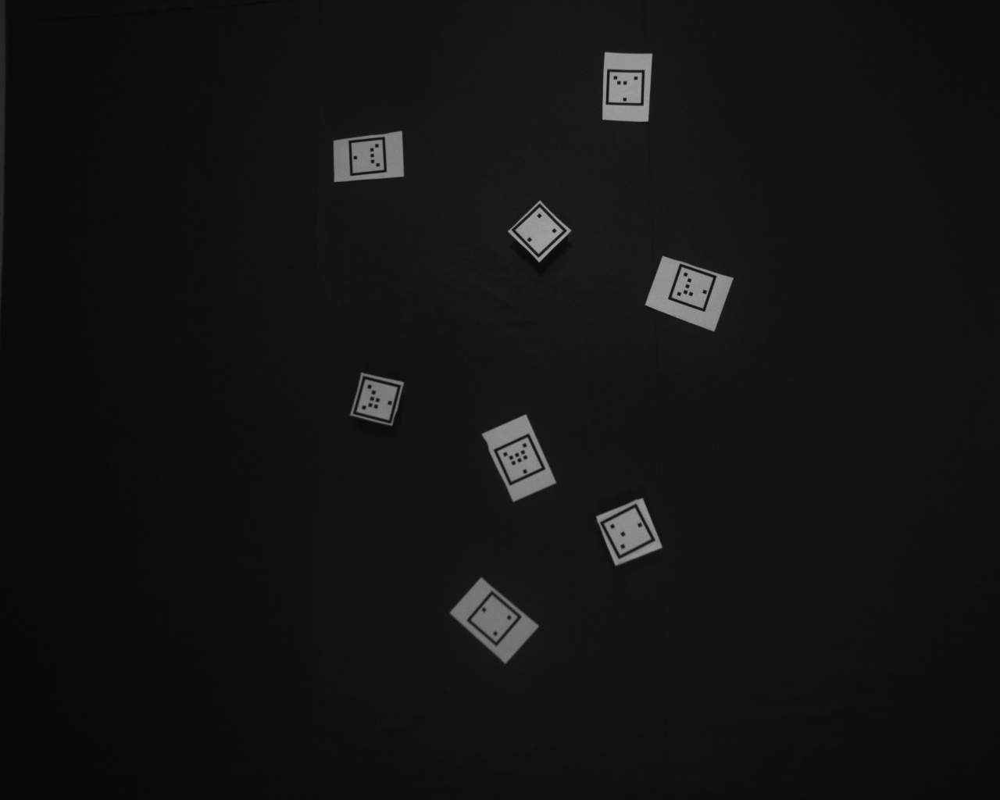

### about
our team comes from Hohai University, Robotics Motion and Vision Lab, which conbines with more than twenty members.
requirements:
Opencv 3.4.8
HiKvision 
### target
recognize multi-cars in real-time and estimate their plane pose(x, y, \theta)
### marker
our marker has updated more than five versions, the latest marker displays the following:

as you can see, the nature of triangle is the bottom edge shorter than the sides.
